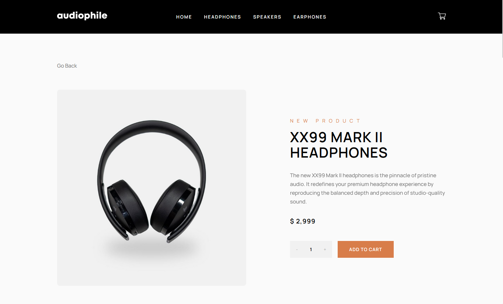
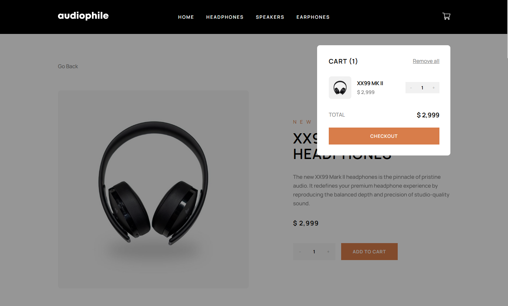
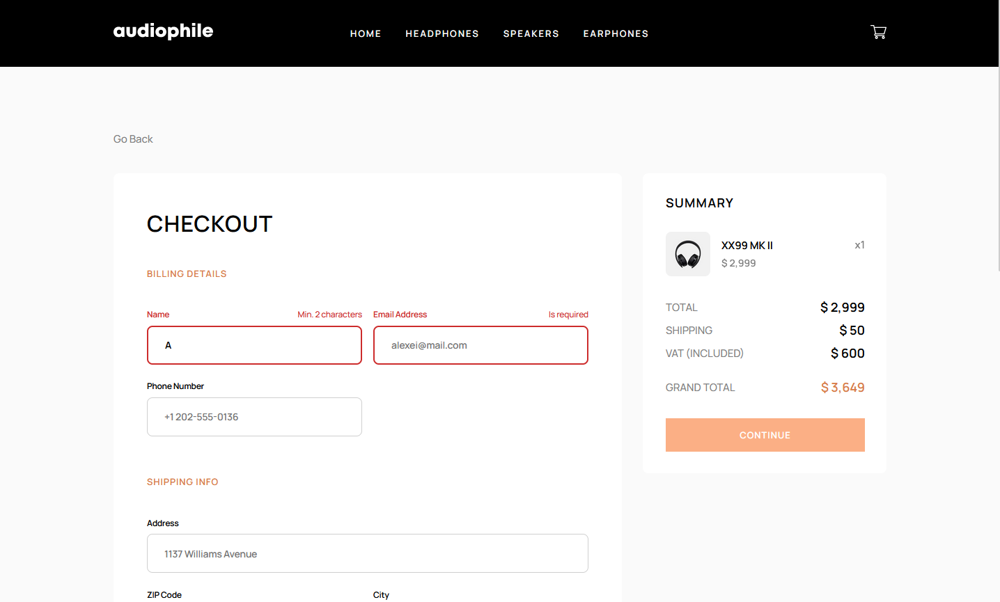
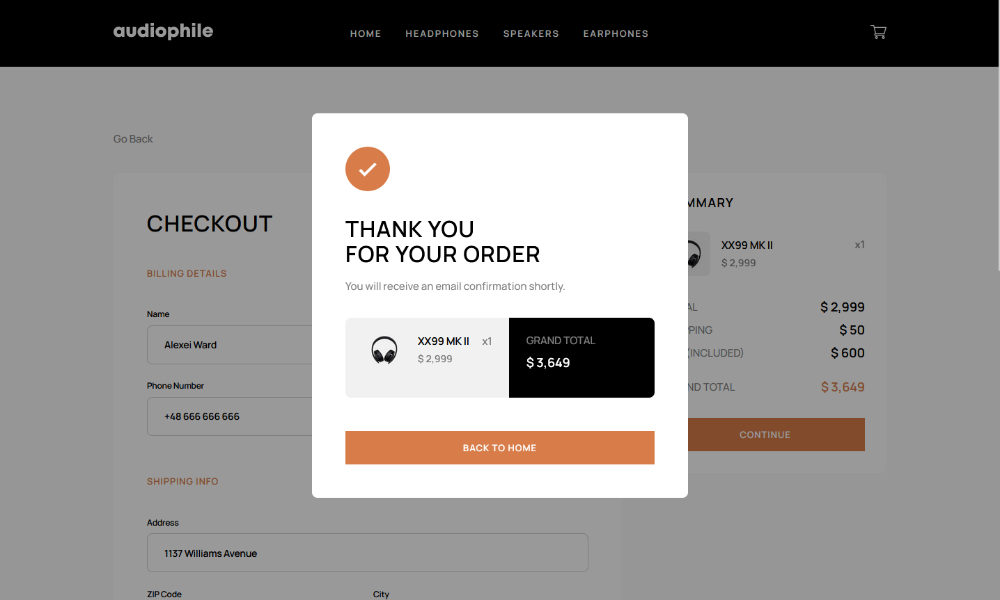
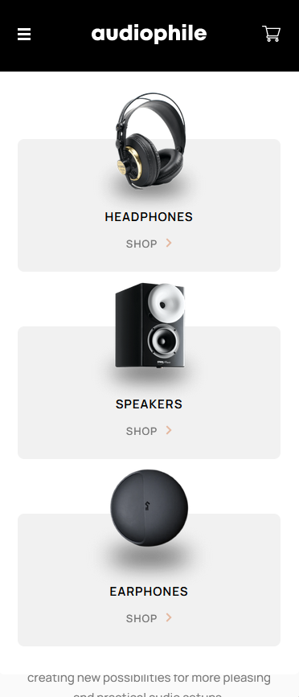
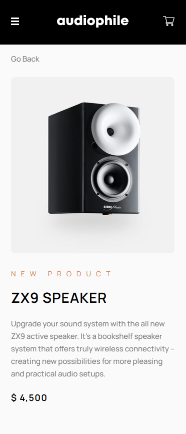
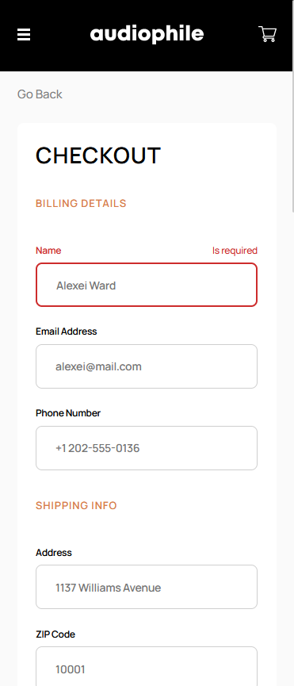

# Frontend Mentor - Audiophile E-commerce Website

 
 
 
 

## Developed with

- React, SCSS modules for a dynamic and stylish user interface.
- The project design is based on BrowserRouter and useContext for efficient
  routing and state management.
- Formik for form management, ensuring efficient and organized handling of form
  data.

## The challenge

Users should be able to:

- View the optimal layout for the app depending on their device's screen size
- See hover states for all interactive elements on the page
- Add/Remove products from the cart
- Edit product quantities in the cart
- Fill in all fields in the checkout
- Receive form validations if fields are missed or incorrect during checkout
- See correct checkout totals depending on the products in the cart
  - Shipping always adds $50 to the order
  - VAT is calculated as 20% of the product total, excluding shipping
- See an order confirmation modal after checking out with an order summary
- **Bonus**: Keep track of what's in the cart, even after refreshing the browser
  (using localStorage)

## Implementation

In the application, React components are imported along with the use of context
and lazy loading for performance optimization. Currently, data is fetched from a
local data.json file, but the application is prepped for server and database
integration. Structures and functions like getAllProducts using axios are
already implemented and ready for use.

For a real-world application, product images could be hosted on platforms such
as AWS S3, Cloudinary, or Google Cloud Storage, with their URLs included in
product data and dynamically rendered.

## Future Development

If this application were tailored for a specific client, it could be expanded to
include additional functionalities. Enhancements could include handling the
entire purchasing process, enabling customers to buy products directly through
the application. Additionally, for store owners, the backend API could be
equipped with tools for easily adding new products to the database and
efficiently managing orders.

In designing this application, emphasis is placed on its flexibility and
scalability, ensuring it can meet the evolving needs of both users and store
owners in the future.
